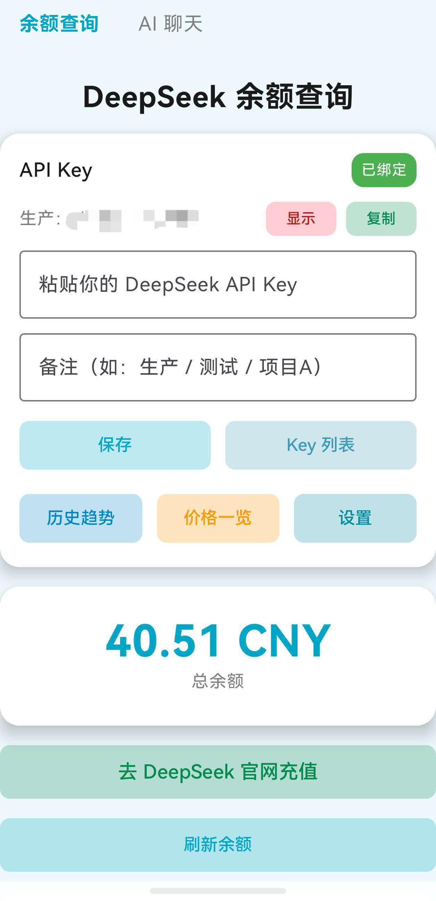
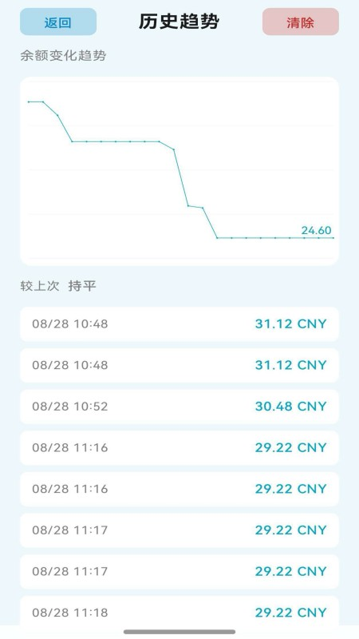
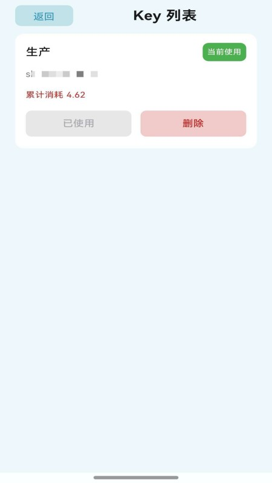
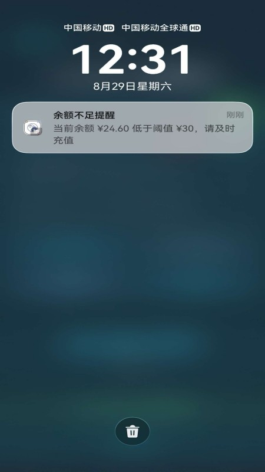
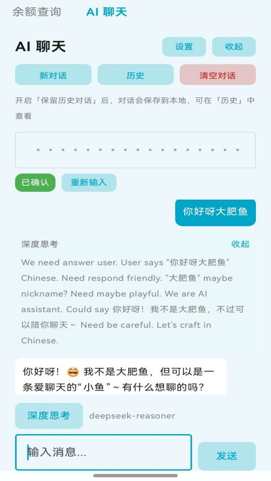
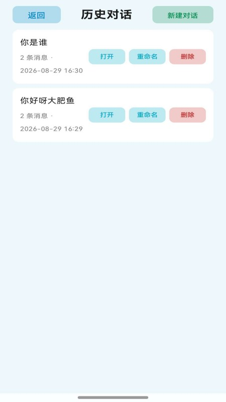
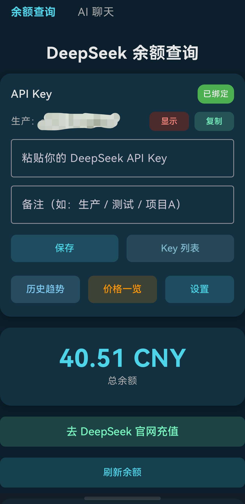

# 🐋 蓝色大肥鱼 (BlueFatFish)

**一款面向 DeepSeek 用户的轻量 Android 助手**

---

## ✨ 功能亮点

| 功能 | 说明 |
|------|------|
| 💰 **余额查询** | 查询 DeepSeek 账户余额与历史趋势 |
| 🔔 **低余额提醒** | 余额低于设定阈值时自动通知 |
| 💬 **AI 聊天** | 支持深度思考模式，畅享智能对话 |
| 🔑 **多 API Key 管理** | 支持多 API Key 加密本地管理 |
| 🌗 **主题切换** | 浅色 / 深色主题自由切换 |
| 🔒 **安全加密** | 所有 Key 本地加密存储，安全无忧 |

---

## 📸 应用截图

### 💰 余额管理

  
  
  

### 🔔 低余额通知

  

### 💬 AI 聊天

  
  

### 🌙 深色模式

  

---

## 项目结构
BlueFatFish_Git\
├─ .gitignore
├─ LICENSE
├─ build.gradle.kts
├─ settings.gradle.kts
├─ gradle.properties
├─ gradlew / gradlew.bat
├─ version.properties
├─ gradle\
└─ app\
   ├─ build.gradle.kts
   ├─ .gitignore
   └─ src\        ← 完整源码与资源

## 📥 下载

点击右侧 **[Releases](https://github.com/Hjnandlizhiyan/BlueFatFish/releases)**，下载最新版 APK。

> ⚠️ 本应用仅发布在 GitHub，请勿从其他渠道下载以免安全风险。

---

## 📖 关于完整版

> **为什么这里的才是完整版？**
>
> 依据中国相关法规，不具备人工智能生成服务资质的个人，不得在国内网站或应用商城发布含 AI 生成内容的软件（包括调用 AI 公司 API 进行内容生成的场景）。因此，本应用仅在 GitHub 发布完整功能版本。

---

## 📞 联系

| 渠道 | 信息 |
|------|------|
| 🐧 **官方 QQ 群** | **305402575** |

---

### ⭐ 如果这个项目对你有帮助，欢迎点亮 Star！

